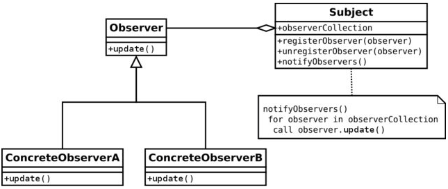

# design-patterns-java

Design patterns are reusable solutions to common problems that arise in software design. They provide a way to create modular, maintainable, and scalable software by capturing best practices and proven design principles. 

In this project, I'm gonna update my study notes about some of the most used Design Patterns and Its implementation on a Spring boot API context.

## Singleton Pattern
Ensures a class has only one instance and provides a global point of access to it.

In Spring Framework, a Singleton is a special type of bean that is only instantiated once and shared across the entire application. This means that any component or class that depends on a Singleton bean will receive the same instance of that bean.

To create a Singleton bean in Spring, you can use either any annotation that extends @Component or @Bean Itself. Here's an example using the @Repository annotation:

    @Repository
    @NoArgsConstructor
    public class InMemoryUserRepository implements UserRepository {
    private final List<User> users = new ArrayList<>();
        @Override
        public User save(User user) {
            users.add(user);
            return user;
        }
        @Override
        public Optional<User> findUserByUsername(String username) {
            return users.stream()
              .filter(user -> user.getUsername().equals(username))
              .findFirst();
        }
    }
As you can see, the code above represents an in-memory database. Therefore, It needs to have only one instance across all the application (Singleton) to ensure that the data can be shared to any Class that injects It.

## Facade Pattern
The Facade design pattern is a structural pattern that provides a simplified interface to a set of interfaces in a subsystem, making it easier to use and understand. It involves creating a higher-level interface that makes the subsystem easier to use for clients, hiding the complexities of the underlying components.

To clarify It, imagine we need to save a User and Its Address. In order to find an Address, we have to consume an external API passing the user zipcode.
In case of failure while consuming the address, we could call a secondary API to give another try.

In order to facilitate this logic and avoid code duplicity, we can create a Facade class that wraps both calls and return an Address:

    @Service
    @RequiredArgsConstructor
    public class AddressService {
        private final CorreiosApiGateway correiosApiGateway;
        private final MyCepApiGateway myCepApiGateway;
        public Optional<Address> findAddressByZipCode(String zipCode) {
            return correiosApiGateway
              .findAddressByZipCode(zipCode)
              .or(() -> myCepApiGateway.findAddressByZipCode(zipCode));
        }
    }

## Observer Pattern
Defines a one-to-many dependency between objects so that when one object changes state, all its dependents are notified and updated automatically. 

The common practice for implementing the Observer pattern is to define an Observer interface (Listener) which will declare a general contact and each observer-implementation should provide an action which would be triggered whenever an event occurs.

A subject maintains a collection of observers (listeners), and exposes methods which allow to add and remove (subscribe/unsubscribe) an observer. Event-related behavior resides in the subject, and when a new event happens, every subscribed observer (i.e. each observer that is currently present in the collection) will be notified.

To exemplify It, lets say we need to notify the User via Whatsapp and Email everytime It is saved in our Repository.
To achieve this behaviour, we can create a UserCreationSubject, that implements the Subject interface, and two Observers, WhatsappNotifierObserver and EmailNotifierObserver, that implements the Observers.

First, we need to declare the following interfaces:

    public interface Observer<T> {  
        void update(T message);
    }

    public interface Subject<T> {
        void addObserver(Observer<T> observer);
        void removeObserver(Observer<T> observer);
        void notifyObservers(T message);
    }

Now we can implement our Subject that will notify a User Creation:

    public class UserCreationSubject implements Subject<User> {
        private final List<Observer<User>> observers = new ArrayList<>();
        @Override
        public void addObserver(Observer<User> observer) {
            observers.add(observer);
        }
        @Override
        public void removeObserver(Observer<User> observer) {
            observers.remove(observer);
        }
        @Override
        public void notifyObservers(User message) {
            for (Observer<User> observer : observers) {
                observer.update(message);
            }
        }
    }
Pretty straightforward, Let's create our two Observers:

    public class WhatsappNotifierObserver implements Observer<User> {
        @Override
        public void update(User message) {
            System.out.println("Sending whatsapp notification to User: " + message.getUsername());
        }
    }

    public class EmailNotifierObserver implements Observer<User> {
        @Override
        public void update(User message) {
            System.out.println("Sending email notification to User: " + message.getUsername());
        }
    }
Now, we have to subscribe our Observers into the Subject and call notifyObservers whenever a User is created on UserService.

Using Spring, we can provide the Subject instance containing both Observers by creating a UserCreationSubject Bean.
To create a Configuration class and define our Bean:

    @Configuration
    public class AppConfig {
        @Bean
        public UserCreationSubject userCreationSubject() {
            var subject = new UserCreationSubject();
            subject.addObserver(new EmailNotifierObserver());
            subject.addObserver(new WhatsappNotifierObserver());
            return subject;
        }
    }

Last, to notify the Observers, just inject the Subject into UserService and calls notifyObservers()

    @Service
    @RequiredArgsConstructor
    public class UserService {
        private final UserCreationSubject userCreationSubject;

        public void saveUser(String username, String email, String password, String zipCode) {
            // Creation logic
            userCreationSubject.notifyObservers(user);
        }
    } 

## Strategy Pattern
Defines a family of algorithms, encapsulates each one, and makes them interchangeable.

In our context, imagine that now we need to send the User Creation Notification only to one provider, instead of sending to all observers, as seen above.
To do that, we can implement the Strategy Pattern to choose whether the notification will be sent by email or whatsapp based on the chose interface implementation.

First, let's define our NotificationService interface:
    
    public interface NotificationService {
        void sendNotification(User user);
    }
Now we can provide two implementations to NotificationService, EmailNotificationService and WhatsappNotificationService.

    @Service("whatsappNotificationService")
    public class WhatsappNotificationService implements NotificationService {
        @Override
        public void sendNotification(User user) {
            System.out.println("Sending whatsapp to: " + user.getUsername());
        }
    }

    @Service("emailNotificationService")
    public class EmailNotificationService implements NotificationService {
        @Override
        public void sendNotification(User user) {
            System.out.println("Sending email to: " + user.getEmail());
        }
    }

Notice that we defined the Bean name explicitly to the implementations. We can use Spring to choose the desired implementation based on the Bean name, as seen below:

    @Service
    @RequiredArgsConstructor
    public class UserService {
        @Qualifier("whatsappNotificationService")
        private final NotificationService notificationService;

        public void saveUser(String username, String email, String password, String zipCode) {
            // User creation code
            notificationService.sendNotification(user);
        }
    }