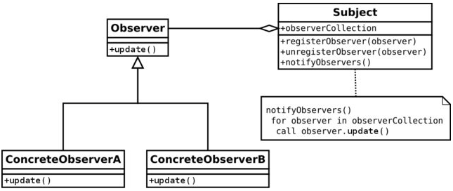

# Observer Pattern
Defines a one-to-many dependency between objects so that when one object changes state, all its dependents are notified and updated automatically.

The common practice for implementing the Observer pattern is to define an Observer interface (Listener) which will declare a general contact and each observer-implementation should provide an action which would be triggered whenever an event occurs.

A subject maintains a collection of observers (listeners), and exposes methods which allow to add and remove (subscribe/unsubscribe) an observer. Event-related behavior resides in the subject, and when a new event happens, every subscribed observer (i.e. each observer that is currently present in the collection) will be notified.

To exemplify It, lets say we need to notify the User via Whatsapp and Email everytime It is saved in our Repository.
To achieve this behaviour, we can create a UserCreationSubject, that implements the Subject interface, and two Observers, WhatsappNotifierObserver and EmailNotifierObserver, that implements the Observers.

First, we need to declare the following interfaces:

    public interface Observer<T> {  
        void update(T message);
    }

    public interface Subject<T> {
        void addObserver(Observer<T> observer);
        void removeObserver(Observer<T> observer);
        void notifyObservers(T message);
    }

Now we can implement our Subject that will notify a User Creation:

    public class UserCreationSubject implements Subject<User> {
        private final List<Observer<User>> observers = new ArrayList<>();
        @Override
        public void addObserver(Observer<User> observer) {
            observers.add(observer);
        }
        @Override
        public void removeObserver(Observer<User> observer) {
            observers.remove(observer);
        }
        @Override
        public void notifyObservers(User message) {
            for (Observer<User> observer : observers) {
                observer.update(message);
            }
        }
    }
Pretty straightforward, Let's create our two Observers:

    public class WhatsappNotifierObserver implements Observer<User> {
        @Override
        public void update(User message) {
            System.out.println("Sending whatsapp notification to User: " + message.getUsername());
        }
    }

    public class EmailNotifierObserver implements Observer<User> {
        @Override
        public void update(User message) {
            System.out.println("Sending email notification to User: " + message.getUsername());
        }
    }
Now, we have to subscribe our Observers into the Subject and call notifyObservers whenever a User is created on UserService.

Using Spring, we can provide the Subject instance containing both Observers by creating a UserCreationSubject Bean.
To create a Configuration class and define our Bean:

    @Configuration
    public class AppConfig {
        @Bean
        public UserCreationSubject userCreationSubject() {
            var subject = new UserCreationSubject();
            subject.addObserver(new EmailNotifierObserver());
            subject.addObserver(new WhatsappNotifierObserver());
            return subject;
        }
    }

Last, to notify the Observers, just inject the Subject into UserService and calls notifyObservers()

    @Service
    @RequiredArgsConstructor
    public class UserService {
        private final UserCreationSubject userCreationSubject;

        public void saveUser(String username, String email, String password, String zipCode) {
            // Creation logic
            userCreationSubject.notifyObservers(user);
        }
    } 
